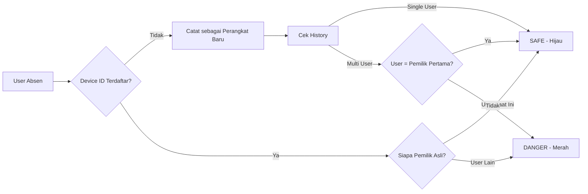

<div align="center">

# 🎯 Sistem Absensi Pintar & Manajemen Kepegawaian (BAPETEN)

### Platform Absensi Berbasis AI dengan Validasi Multi-Layer untuk Mencegah Kecurangan


</div>

---

## 📋 Daftar Isi

- [📖 Tentang Sistem](#-tentang-sistem)
- [✨ Fitur Utama](#-fitur-utama)
- [🔐 Sistem Keamanan & Anti-Fraud](#-sistem-keamanan--anti-fraud)
- [🏗️ Arsitektur & Teknologi](#️-arsitektur--teknologi)
- [📂 Struktur Proyek](#-struktur-proyek)
- [⚙️ Prasyarat Sistem](#️-prasyarat-sistem)
- [🚀 Panduan Instalasi](#-panduan-instalasi)
- [📱 Cara Penggunaan](#-cara-penggunaan)
- [🎨 Fitur Manajemen](#-fitur-manajemen)
- [🔧 Konfigurasi Lanjutan](#-konfigurasi-lanjutan)
- [📊 Modul & Komponen](#-modul--komponen)

---

## 📖 Tentang Sistem

**Sistem Absensi Pintar BAPETEN** adalah aplikasi berbasis web modern yang dirancang sebagai **Progressive Web App (PWA)** dengan fokus pada **integritas data kehadiran** dan **pencegahan kecurangan (anti-joki)**. 

Sistem ini mengimplementasikan **validasi berlapis tiga** untuk memastikan kehadiran yang sah:

<div align="center">

| 🌍 **DIMANA?** | 👤 **SIAPA?** | 📱 **PAKAI APA?** |
|:---:|:---:|:---:|
| Validasi GPS & Radius Lokasi | Verifikasi Wajah dengan AI | Analisis Risiko Perangkat |
| Haversine Formula | Face-api.js (TensorFlow) | Device Fingerprinting |

</div>

### 🎯 Tujuan Utama

- ✅ **Menghilangkan praktik joki** (titip absen) dengan teknologi AI
- ✅ **Meningkatkan akurasi** data kehadiran karyawan/magang
- ✅ **Mempermudah monitoring** real-time untuk administrator
- ✅ **Memberikan pengalaman terbaik** dengan interface yang responsif dan intuitif

---

## ✨ Fitur Utama

### 🚀 Untuk Pengguna (Karyawan/Magang)

<table>
<tr>
<td width="50%">

#### 📸 **Absensi dengan Verifikasi Wajah**
- Deteksi wajah otomatis menggunakan AI
- Mode kamera selfie (mirrored/mirror view)
- Passive liveness detection (Hold Still)
- Validasi threshold yang dapat disesuaikan

</td>
<td width="50%">

#### 🗺️ **Validasi Lokasi GPS**
- Verifikasi radius otomatis dari kantor
- Perhitungan jarak dengan Haversine Formula
- Support geolocation HTML5 modern
- Akurasi lokasi real-time

</td>
</tr>
<tr>
<td>

#### 📊 **Dashboard Interaktif**
- Kalender kehadiran bulanan
- Widget peringatan jika belum absen
- Progress bar hari kerja
- Statistik kehadiran personal

</td>
<td>

#### 📝 **Manajemen Izin & Koreksi**
- Pengajuan izin (Sakit, Cuti, Dinas)
- Koreksi kehadiran dengan bukti
- Upload attachment/dokumen pendukung
- Status approval real-time

</td>
</tr>
</table>

### 🛠️ Untuk Administrator

<table>
<tr>
<td width="50%">

#### 👥 **Manajemen Pengguna**
- CRUD pengguna lengkap dengan role
- Manajemen unit kerja & jabatan
- Upload foto profil (avatar)
- Bulk import dari Excel/CSV

</td>
<td width="50%">

#### ⚙️ **Pengaturan Dinamis**
- Konfigurasi koordinat kantor
- Atur radius maksimal (meter)
- Toggle validasi wajah on/off
- Pengaturan jadwal Ramadan

</td>
</tr>
<tr>
<td>

#### 📈 **Laporan & Eksport**
- Export data ke Excel/CSV
- Filter berdasarkan tanggal & unit
- Laporan keterlambatan otomatis
- Statistik kehadiran per periode

</td>
<td>

#### 🔗 **Registration Link**
- Generate link pendaftaran unik
- QR Code untuk onboarding massal
- Masa berlaku link yang fleksibel
- Assign jabatan otomatis

</td>
</tr>
</table>

### 📱 **Progressive Web App (PWA)**

- 📲 **Installable**: Dapat diinstal seperti aplikasi native di Android & iOS
- 🚀 **Fast Loading**: Service Worker untuk caching aset
- 📶 **Offline Support**: Tetap bisa diakses saat jaringan terputus
- 🔔 **Push Notifications**: Notifikasi reminder absensi (opsional)

---

## 🔐 Sistem Keamanan & Anti-Fraud

### 🛡️ Risk-Based Authentication

Sistem menggunakan algoritma **Risk Level Analysis** yang mengklasifikasikan setiap absensi berdasarkan histori perangkat:

<table>
<thead>
<tr>
<th>Risk Level</th>
<th>Warna Indikator</th>
<th>Kondisi</th>
<th>Aksi Sistem</th>
</tr>
</thead>
<tbody>
<tr>
<td><strong>🟢 SAFE</strong></td>
<td>Hijau</td>
<td>Pengguna absen dengan perangkat pribadi yang terdaftar pertama kali</td>
<td>✅ Absensi divalidasi normal</td>
</tr>
<tr>
<td><strong>🟡 WARNING</strong></td>
<td>Kuning</td>
<td>Perangkat pribadi pengguna dipinjam oleh orang lain</td>
<td>⚠️ Flagging untuk review manual</td>
</tr>
<tr>
<td><strong>🔴 DANGER</strong></td>
<td>Merah</td>
<td>Pengguna terdeteksi menggunakan perangkat orang lain (JOKI)</td>
<td>🚨 Alert admin + Block (opsional)</td>
</tr>
</tbody>
</table>

#### 📌 Cara Kerja Logika Anti-Joki



**Implementasi di Code**: `app/Http/Controllers/AbsensiController.php` (Method: `checkIn()`)

### 🔍 Device Fingerprinting

Sistem mencatat dan melacak setiap perangkat yang digunakan dengan data:
- **Device Unique ID**: Hash kombinasi user agent + screen resolution + timezone
- **Browser & OS Info**: Deteksi dengan library `jenssegers/agent`
- **IP Address**: Untuk deteksi anomali lokasi
- **Last Used Timestamp**: Riwayat penggunaan terakhir

**Database**: Tabel `user_devices` menyimpan seluruh histori penggunaan perangkat.

### 👁️ Face Recognition AI

**Teknologi**: `face-api.js` (TensorFlow.js)

**Model AI yang Digunakan**:
- `ssd_mobilenetv1`: Deteksi wajah cepat
- `face_recognition_model`: Ekstraksi fitur wajah 128-dimensi
- `face_landmark_68`: Deteksi 68 titik landmark wajah
- `tiny_face_detector`: Deteksi wajah ringan untuk mobile

**Fitur Keamanan**:
- ✅ **Liveness Detection**: Passive mode - user harus diam 1-2 detik
- ✅ **Similarity Threshold**: Admin bisa atur tingkat keketatan (0.0 - 1.0)
- ✅ **No Server-side Processing**: Face matching di browser (privacy-first)
- ✅ **Automatic Capture**: Foto diambil otomatis saat wajah stabil

---

## 🏗️ Arsitektur & Teknologi

### 📚 Tech Stack

<table>
<thead>
<tr>
<th>Kategori</th>
<th>Teknologi</th>
<th>Versi</th>
<th>Kegunaan</th>
</tr>
</thead>
<tbody>
<tr>
<td><strong>🎨 Backend Framework</strong></td>
<td>Laravel</td>
<td>v12.x</td>
<td>Core logic, routing, ORM (Eloquent), middleware, authentication</td>
</tr>
<tr>
<td><strong>🎛️ Admin Panel</strong></td>
<td>FilamentPHP</td>
<td>v4.x</td>
<td>CRUD generator, dashboard builder, form components</td>
</tr>
<tr>
<td><strong>⚛️ Frontend</strong></td>
<td>Alpine.js & Livewire</td>
<td>Latest</td>
<td>Reactive components tanpa kompleksitas SPA framework</td>
</tr>
<tr>
<td><strong>🎨 CSS Framework</strong></td>
<td>Tailwind CSS</td>
<td>v4.x</td>
<td>Utility-first styling, responsive design</td>
</tr>
<tr>
<td><strong>🗄️ Database</strong></td>
<td>MySQL / MariaDB / SQLite</td>
<td>8.0+ / 10.6+ / Latest</td>
<td>Relational database untuk data persistence</td>
</tr>
<tr>
<td><strong>🤖 AI Library</strong></td>
<td>Face-api.js</td>
<td>Latest</td>
<td>Client-side face detection & recognition (TensorFlow.js)</td>
</tr>
<tr>
<td><strong>📱 PWA</strong></td>
<td>Laravel PWA</td>
<td>v2.x</td>
<td>Service worker, manifest, offline support</td>
</tr>
<tr>
<td><strong>📊 Export Data</strong></td>
<td>Maatwebsite Excel</td>
<td>v3.x</td>
<td>Export/Import Excel & CSV</td>
</tr>
<tr>
<td><strong>🔍 Device Detection</strong></td>
<td>Jenssegers Agent</td>
<td>v2.x</td>
<td>User agent parser (browser, OS, device info)</td>
</tr>
<tr>
<td><strong>🗺️ Geolocation</strong></td>
<td>HTML5 Geolocation API</td>
<td>Native</td>
<td>GPS coordinate detection dari browser</td>
</tr>
</tbody>
</table>

### 🏛️ Arsitektur Aplikasi

```
┌─────────────────────────────────────────────────────────────┐
│                        USER LAYER                           │
│  (Browser - PWA Installable dengan Service Worker)         │
└───────────────────┬─────────────────────────────────────────┘
                    │
                    ▼
┌─────────────────────────────────────────────────────────────┐
│                    PRESENTATION LAYER                       │
│  ┌──────────────┐  ┌──────────────┐  ┌──────────────┐      │
│  │ Filament     │  │ Blade Views  │  │ Alpine.js    │      │
│  │ Admin Panel  │  │ (Frontend)   │  │ Components   │      │
│  └──────────────┘  └──────────────┘  └──────────────┘      │
└───────────────────┬─────────────────────────────────────────┘
                    │
                    ▼
┌─────────────────────────────────────────────────────────────┐
│                    APPLICATION LAYER                        │
│  ┌──────────────┐  ┌──────────────┐  ┌──────────────┐      │
│  │ Controllers  │  │ Services     │  │ Middleware   │      │
│  │ (HTTP Layer) │  │ (Business)   │  │ (Auth/Guard) │      │
│  └──────────────┘  └──────────────┘  └──────────────┘      │
└───────────────────┬─────────────────────────────────────────┘
                    │
                    ▼
┌─────────────────────────────────────────────────────────────┐
│                       DOMAIN LAYER                          │
│  ┌────────────────────────────────────────────────┐         │
│  │  Models (Eloquent ORM)                         │         │
│  │  • User  • Absence  • Setting  • Permission   │         │
│  │  • UserDevice  • Holiday  • AttendanceCorrection         │
│  └────────────────────────────────────────────────┘         │
└───────────────────┬─────────────────────────────────────────┘
                    │
                    ▼
┌─────────────────────────────────────────────────────────────┐
│                    INFRASTRUCTURE LAYER                     │
│  ┌──────────────┐  ┌──────────────┐  ┌──────────────┐      │
│  │   Database   │  │ File Storage │  │ External API │      │
│  │ (MySQL/SQLite)   │ (Local/S3)   │  │ (Face-api.js)      │
│  └──────────────┘  └──────────────┘  └──────────────┘      │
└─────────────────────────────────────────────────────────────┘
```

---

## 📂 Struktur Proyek

### 🗂️ Direktori Utama

```
absensi-system/
│
├── app/                          # Core aplikasi Laravel
│   ├── Console/                  # Artisan commands & scheduling
│   ├── Exports/                  # Export classes (Excel/CSV)
│   ├── Filament/                 # ⭐ FilamentPHP resources
│   │   ├── Resources/            # CRUD resources
│   │   │   ├── Absences/         # Manajemen data kehadiran
│   │   │   ├── Users/            # Manajemen pengguna
│   │   │   ├── Settings/         # Pengaturan sistem
│   │   │   ├── Permissions/      # Pengajuan izin
│   │   │   └── ...               # Jabatan, Unit Kerja, Holidays
│   │   ├── Pages/                # Custom pages
│   │   │   └── Auth/             # Halaman autentikasi custom
│   │   ├── Widgets/              # Dashboard widgets
│   │   │   ├── AdminAttendanceStats.php
│   │   │   ├── AdminLateListWidget.php
│   │   │   └── AdminScheduleInfoWidget.php
│   │   └── User/                 # User panel (non-admin)
│   │       ├── Pages/            # Halaman absensi user
│   │       ├── Resources/        # CRUD khusus user
│   │       └── Widgets/          # Widget user dashboard
│   │
│   ├── Http/                     # HTTP layer
│   │   ├── Controllers/          # ⭐ Business logic controllers
│   │   │   ├── AbsensiController.php    # ⚡ Core absensi logic
│   │   │   ├── AuthController.php       # Custom authentication
│   │   │   ├── DirectAttendanceController.php
│   │   │   └── AbsenceExportController.php
│   │   └── Middleware/           # Custom middleware
│   │
│   ├── Models/                   # ⭐ Eloquent models (Database entities)
│   │   ├── User.php              # User model + relationships
│   │   ├── Absence.php           # Attendance records
│   │   ├── UserDevice.php        # Device fingerprinting
│   │   ├── Setting.php           # App configuration
│   │   ├── Permission.php        # Leave requests
│   │   ├── AttendanceCorrection.php
│   │   ├── Holiday.php           # National/company holidays
│   │   ├── Jabatan.php           # Job positions
│   │   ├── UnitKerja.php         # Work units/departments
│   │   └── RegistrationLink.php  # Unique registration links
│   │
│   ├── Observers/                # Model observers (events)
│   ├── Providers/                # Service providers
│   └── Services/                 # ⭐ Business logic services
│       ├── GeoLocationService.php     # Haversine distance calculation
│       ├── AttendanceService.php      # Attendance business logic
│       └── HolidayService.php         # Holiday checking
│
├── bootstrap/                    # Framework bootstrap files
├── config/                       # ⭐ Configuration files
│   ├── laravelpwa.php            # PWA configuration
│   ├── database.php              # DB connection settings
│   ├── filesystems.php           # Storage configuration
│   └── ...                       # Laravel configs
│
├── database/                     # Database related files
│   ├── migrations/               # ⭐ Database schema migrations
│   │   ├── *_create_absences_table.php
│   │   ├── *_create_user_devices_table.php
│   │   ├── *_create_settings_table.php
│   │   └── ...                   # 20+ migration files
│   ├── seeders/                  # ⭐ Database seeders
│   │   ├── DatabaseSeeder.php    # Main seeder
│   │   ├── SettingSeeder.php     # Default settings
│   │   ├── JabatanSeeder.php     # Job positions
│   │   └── UnitKerjaSeeder.php   # Work units
│   └── factories/                # Model factories untuk testing
│
├── public/                       # ⭐ Public assets (web root)
│   ├── build/                    # Compiled assets (Vite)
│   ├── images/                   # Static images & PWA icons
│   │   ├── icons/                # PWA icon sizes (72px - 512px)
│   │   └── logos/                # App logos
│   ├── models/                   # ⭐ Face-api.js AI models
│   │   ├── ssd_mobilenetv1_model-*
│   │   ├── face_recognition_model-*
│   │   ├── face_landmark_68_model-*
│   │   └── tiny_face_detector_model-*
│   ├── js/filament/              # Filament JS bundles
│   └── index.php                 # Entry point
│
├── resources/                    # Raw frontend resources
│   ├── css/                      # Styles (akan dicompile Vite)
│   │   └── app.css               # Main CSS + Tailwind imports
│   ├── js/                       # JavaScript (akan dicompile)
│   │   └── app.js                # Main JS entry point
│   └── views/                    # ⭐ Blade templates
│       ├── components/           # Reusable components
│       ├── auth/                 # Login & registration views
│       └── filament/             # Filament view overrides
│           ├── user/
│           │   ├── pages/
│           │   │   ├── absensi.blade.php    # ⚡ Camera & map UI
│           │   │   └── profile.blade.php    # User profile page
│           │   └── widgets/      # User dashboard widgets
│           └── widgets/          # Admin dashboard widgets
│
├── routes/                       # ⭐ Application routes
│   ├── web.php                   # Web routes (main)
│   ├── api.php                   # API routes (jika ada)
│   └── console.php               # Artisan console routes
│
├── storage/                      # Storage directory
│   ├── app/                      # Application storage
│   │   ├── public/               # Public storage (linked)
│   │   │   ├── avatars/          # User profile pictures
│   │   │   ├── captures/         # Face capture images
│   │   │   └── attachments/      # Permission attachments
│   ├── framework/                # Framework generated files
│   └── logs/                     # Application logs
│
├── tests/                        # Testing directory
│   ├── Feature/                  # Feature tests
│   └── Unit/                     # Unit tests
│
├── .env.example                  # Environment template
├── artisan                       # Laravel Artisan CLI
├── composer.json                 # PHP dependencies
├── package.json                  # Node dependencies
├── vite.config.js                # Vite bundler config
└── README.md                     # Documentation (this file)
```

### 🎯 File Penting untuk Dipahami

| File/Direktori | Deskripsi Detail |
|----------------|------------------|
| `app/Http/Controllers/AbsensiController.php` | ⚡ **Core logic check-in/check-out**. Berisi algoritma risk analysis, device validation, face recognition handling, dan geolocation validation |
| `app/Services/GeoLocationService.php` | Implementasi Haversine Formula untuk menghitung jarak GPS |
| `app/Models/Absence.php` | Model data kehadiran dengan helper methods (hasCheckedInToday, getTodayAbsence, dll) |
| `app/Models/Setting.php` | Model pengaturan dengan getter/setter dynamic (getOfficeLocation, getRamadanSettings) |
| `resources/views/filament/user/pages/absensi.blade.php` | ⚡ **UI Kamera & Map**. Integrasi face-api.js, canvas drawing, geolocation API |
| `database/migrations/*_create_absences_table.php` | Schema tabel kehadiran lengkap dengan risk_level, device_info, capture_image |
| `database/seeders/SettingSeeder.php` | Default settings yang dimuat saat pertama kali install |
| `config/laravelpwa.php` | Konfigurasi PWA (nama app, icon, theme color, shortcuts) |

---

## ⚙️ Prasyarat Sistem

### 🖥️ Server Requirements

<table>
<thead>
<tr>
<th>Komponen</th>
<th>Minimum Requirement</th>
<th>Rekomendasi</th>
</tr>
</thead>
<tbody>
<tr>
<td><strong>PHP</strong></td>
<td>8.2</td>
<td>8.3 atau lebih tinggi</td>
</tr>
<tr>
<td><strong>Memory</strong></td>
<td>256 MB</td>
<td>512 MB atau lebih</td>
</tr>
<tr>
<td><strong>Database</strong></td>
<td>MySQL 8.0+ / MariaDB 10.6+ / SQLite 3.35+</td>
<td>MySQL 8.0+ atau MariaDB 10.11+</td>
</tr>
<tr>
<td><strong>Web Server</strong></td>
<td>Apache 2.4+ / Nginx 1.18+</td>
<td>Nginx 1.24+ dengan PHP-FPM</td>
</tr>
<tr>
<td><strong>Node.js</strong></td>
<td>18.x</td>
<td>20.x LTS</td>
</tr>
<tr>
<td><strong>NPM</strong></td>
<td>9.x</td>
<td>10.x</td>
</tr>
<tr>
<td><strong>Composer</strong></td>
<td>2.5+</td>
<td>2.7+</td>
</tr>
</tbody>
</table>

### 📦 PHP Extensions (Required)

```bash
✅ BCMath
✅ Ctype
✅ cURL
✅ DOM
✅ Fileinfo
✅ JSON
✅ Mbstring
✅ OpenSSL
✅ PCRE
✅ PDO
✅ Tokenizer
✅ XML
✅ GD atau Imagick (untuk image processing)
```

### 🔐 Penting untuk Production

<div style="background: #FEF3C7; padding: 15px; border-left: 4px solid #F59E0B; margin: 10px 0;">

⚠️ **SSL/HTTPS WAJIB untuk Production!**

Fitur **Kamera (getUserMedia)** dan **GPS (Geolocation API)** hanya berfungsi di:
- `https://` domain
- `localhost` untuk development

Gunakan **Let's Encrypt** (gratis) atau SSL provider lainnya.

</div>

---

## 🚀 Panduan Instalasi

### 📥 Metode 1: Manual Installation (Lengkap)

#### Step 1: Clone Repository

```bash
# Clone dari GitHub
git clone https://github.com/SulthanRaghib/absensi-system.git
cd absensi-system
```

#### Step 2: Install Dependencies

```bash
# Install PHP dependencies
composer install

# Install Node.js dependencies
npm install
```

#### Step 3: Setup Environment

```bash
# Copy environment file
cp .env.example .env

# Generate application key
php artisan key:generate
```

#### Step 4: Konfigurasi Database

Edit file `.env` dan sesuaikan konfigurasi database Anda:

```env
APP_NAME="Sistem Absensi BAPETEN"
APP_ENV=production
APP_DEBUG=false
APP_URL=https://yourdomain.com

# Database Configuration
DB_CONNECTION=mysql
DB_HOST=127.0.0.1
DB_PORT=3306
DB_DATABASE=absensi_db
DB_USERNAME=root
DB_PASSWORD=your_password

# Timezone (Indonesia)
APP_TIMEZONE=Asia/Jakarta
APP_LOCALE=id
```

#### Step 5: Migration & Seeding

```bash
# Jalankan migrasi database
php artisan migrate

# Seed data awal (settings, jabatan, unit kerja)
php artisan db:seed
```

<details>
<summary>📌 <b>Data Default yang Akan Dibuat</b> (klik untuk expand)</summary>

**Default Admin Account**:
- Email: `admin@bapeten.go.id`
- Password: `password` 

<div style="background: #FEE2E2; padding: 10px; border-left: 3px solid #EF4444;">

⚠️ **PENTING - Keamanan Password**: 

Password default `password` sangat lemah dan harus **SEGERA DIGANTI** setelah instalasi pertama! 

**Rekomendasi**:
1. Login segera setelah instalasi
2. Ubah password menjadi kombinasi yang kuat (min. 12 karakter, huruf besar/kecil, angka, simbol)
3. Atau modifikasi `database/seeders/DatabaseSeeder.php` untuk generate random password dan tampilkan di console saat seeding

</div>

**Default Settings**:
- Office Latitude: `-6.163836`
- Office Longitude: `106.8189579`
- Office Radius: `100` meter
- Face Recognition: `Enabled`
- Device Validation: `Enabled`

</details>

#### Step 6: Link Storage & PWA Setup

```bash
# Link storage public
php artisan storage:link

# Publish PWA assets
php artisan pwa:publish
```

#### Step 7: Build Frontend Assets

```bash
# Development mode (dengan watch)
npm run dev

# Production mode (minified)
npm run build
```

#### Step 8: Run Application

```bash
# Development server
php artisan serve

# Akses di: http://127.0.0.1:8000
```

**Untuk Production**: Setup web server (Nginx/Apache) agar document root mengarah ke folder `public/`.

---

### ⚡ Metode 2: Quick Setup (Otomatis)

Gunakan composer script yang sudah disediakan:

```bash
composer setup
```

Script ini akan otomatis menjalankan:
1. `composer install`
2. Copy `.env.example` ke `.env`
3. `php artisan key:generate`
4. `php artisan migrate --force`
5. `npm install`
6. `npm run build`

⚠️ **Catatan**: Anda tetap perlu konfigurasi `.env` untuk database sebelum menjalankan.

---

### 🐳 Metode 3: Docker (Opsional)

Jika Anda prefer Docker (coming soon), gunakan Laravel Sail:

```bash
# Install Sail
composer require laravel/sail --dev

# Publish Sail configuration
php artisan sail:install

# Start containers
./vendor/bin/sail up -d
```

---

## 📱 Cara Penggunaan

### 👤 Untuk Pengguna (Karyawan/Magang)

#### 1️⃣ Login ke Sistem

1. Buka URL aplikasi di browser: `https://absensi.yourdomain.com`
2. Masukkan **Email** dan **Password** yang diberikan admin
3. Pilih **"User Panel"** untuk akses dashboard pengguna

<div align="center">
<i>💡 Tip: Install sebagai PWA dengan klik "Add to Home Screen" di browser mobile!</i>
</div>

#### 2️⃣ Absensi Masuk (Check-In)

**Waktu**: Sebelum atau sesudah jam kerja (konfigurasi admin)

**Langkah-langkah**:

1. **Buka Menu Absensi**
   - Klik menu **"📍 Absensi"** di sidebar
   - Atau klik quick action di dashboard

2. **Verifikasi Wajah**
   - Kamera akan terbuka otomatis
   - Posisikan wajah Anda di tengah frame
   - Pastikan pencahayaan cukup (tidak terlalu gelap/terang)
   - Tunggu hingga muncul instruksi **"Tahan... Jangan Bergerak"**
   - Foto akan diambil otomatis dalam 1-2 detik

   <div style="background: #DBEAFE; padding: 10px; border-left: 3px solid #3B82F6;">
   ℹ️ <strong>Tips Foto Wajah</strong>:
   <ul>
   <li>Lepas kacamata hitam & masker</li>
   <li>Jangan bergerak saat countdown</li>
   <li>Pastikan wajah terlihat penuh (tidak terpotong)</li>
   </ul>
   </div>

3. **Validasi Lokasi**
   - Jika wajah valid, sistem akan meminta izin GPS
   - Klik **"Allow"** pada popup browser
   - Sistem akan otomatis menghitung jarak dari kantor
   - Jika dalam radius, absensi berhasil ✅

4. **Konfirmasi**
   - Notifikasi sukses akan muncul
   - Data tercatat di dashboard Anda

#### 3️⃣ Absensi Pulang (Check-Out)

**Waktu**: Setelah jam pulang (konfigurasi admin)

**Langkah-langkah** sama seperti check-in, tetapi:
- Tombol berubah menjadi **"Absen Pulang"**
- Tidak perlu validasi wajah lagi (opsional, tergantung setting admin)
- Hanya validasi lokasi GPS

#### 4️⃣ Lihat Riwayat Kehadiran

1. Klik **"📊 Dashboard"**
2. Scroll ke widget **"Kalender Kehadiran"**
3. Lihat status per hari:
   - 🟢 Hadir Tepat Waktu
   - 🟡 Terlambat
   - 🔴 Tidak Hadir
   - 🟣 Izin/Cuti

#### 5️⃣ Ajukan Izin/Cuti

1. Klik menu **"📝 Izin"** → **"Buat Baru"**
2. Pilih **Jenis Izin**:
   - 🤒 Sakit
   - ✈️ Cuti
   - 🏢 Dinas Luar
   - 📄 Lainnya
3. Isi formulir:
   - Tanggal Mulai & Selesai
   - Alasan/Keterangan
   - Upload Dokumen Pendukung (opsional)
4. Klik **"Submit"**
5. Tunggu approval dari admin/atasan

#### 6️⃣ Koreksi Kehadiran

Jika lupa absen atau terjadi kesalahan teknis:

1. Menu **"🔧 Koreksi Kehadiran"** → **"Ajukan"**
2. Pilih **Tanggal** yang ingin dikoreksi
3. Isi waktu check-in/check-out yang seharusnya
4. Tulis **Alasan** yang jelas
5. Upload **Bukti Pendukung** (screenshot, foto, dll)
6. Submit dan tunggu approval admin

---

### 👨‍💼 Untuk Administrator

#### 1️⃣ Login sebagai Admin

1. Login dengan akun admin
2. Pilih **"Admin Panel"**
3. Dashboard admin akan terbuka

#### 2️⃣ Manajemen Pengguna

**Tambah User Baru**:
1. Menu **"👥 Users"** → **"Create"**
2. Isi data:
   - Nama Lengkap
   - Email (untuk login)
   - Password (minimal 8 karakter)
   - Role: `admin` atau `user`
   - Unit Kerja & Jabatan
3. Upload foto profil (opsional)
4. **Save**

**Import Massal dari Excel**:
1. Menu **"👥 Users"** → **"Import"**
2. Download template Excel
3. Isi data sesuai format
4. Upload file → Proses

#### 3️⃣ Kelola Unit Kerja & Jabatan

**Unit Kerja** (Departemen):
- Menu **"🏢 Unit Kerja"**
- Create/Edit/Delete unit kerja
- Contoh: IT, HRD, Finance, Marketing

**Jabatan** (Posisi):
- Menu **"💼 Jabatan"**
- Create/Edit/Delete jabatan
- Contoh: Manager, Staff, Intern

#### 4️⃣ Generate Registration Link

Untuk onboarding magang/karyawan baru secara massal:

1. Menu **"🔗 Registration Links"** → **"Create"**
2. Set parameter:
   - **Jabatan Default**: Otomatis assign jabatan
   - **Masa Berlaku**: Contoh 7 hari
   - **Status**: Aktif/Nonaktif
3. **Generate Link**
4. Copy link atau download **QR Code**
5. Bagikan ke peserta melalui WhatsApp/Email

**Cara Penggunaan oleh Peserta**:
- Scan QR atau buka link
- Isi form registrasi (nama, email, password)
- Otomatis terdaftar dengan jabatan yang sudah ditentukan

#### 5️⃣ Pengaturan Sistem (Settings)

Menu **"⚙️ Settings"** → Konfigurasi:

**A. Lokasi Kantor**:
```
Office Latitude:  -6.163836
Office Longitude: 106.8189579
Office Radius:    100 meter (sesuaikan)
```

**B. Jadwal Kerja**:
```
Jam Masuk:         07:30
Jam Pulang:        16:00
Jam Pulang Jumat:  16:30
```

**C. Jadwal Ramadan** (Opsional):
```
Tanggal Mulai:     2025-03-10
Tanggal Selesai:   2025-04-09
Jam Masuk Ramadan: 08:00
Jam Pulang Ramadan: 15:30
```

**D. Validasi Keamanan**:
- ✅ **Face Recognition Enabled**: ON/OFF
- ✅ **Device Validation Enabled**: ON/OFF
- **Face Threshold**: 0.6 (0.0 - 1.0, semakin rendah semakin ketat)

**E. Hari Libur**:
- Menu **"📅 Holidays"** → Tambah hari libur nasional/cuti bersama
- Sistem otomatis tidak menghitung hari libur sebagai absen

#### 6️⃣ Monitoring & Laporan

**Dashboard Analytics**:
- Widget **Total Hadir Hari Ini**
- Widget **Total Terlambat**
- Widget **Tidak Hadir**
- Chart **Kehadiran 7 Hari Terakhir**

**Export Data**:
1. Menu **"📊 Absences"**
2. Filter:
   - Tanggal Mulai - Selesai
   - Unit Kerja
   - Status (Hadir/Terlambat/Tidak Hadir)
3. Klik **"Export to Excel"**
4. File akan terdownload otomatis

**Format Export**:
```
Nama | NIP | Unit | Jabatan | Tanggal | Jam Masuk | Jam Pulang | Status | Risk Level
```

#### 7️⃣ Approval Izin & Koreksi

**Menu "📝 Permissions"**:
- Lihat daftar pengajuan izin dengan status `Pending`
- Klik **"View"** → **"Approve"** atau **"Reject"**
- Jika reject, isi alasan penolakan

**Menu "🔧 Attendance Corrections"**:
- Review pengajuan koreksi kehadiran
- Periksa bukti yang dilampirkan
- Approve/Reject dengan catatan

---

## 🎨 Fitur Manajemen

### 📊 Dashboard Widgets

<table>
<tr>
<td width="50%">

#### 🎛️ Admin Dashboard

- **Attendance Stats Widget**: Total hadir, terlambat, izin, tidak hadir hari ini
- **Late List Widget**: Daftar user yang terlambat hari ini
- **Absent List Widget**: Daftar user yang belum absen
- **Schedule Info Widget**: Informasi jam kerja aktif
- **Last 7 Days Chart**: Grafik kehadiran seminggu terakhir

</td>
<td width="50%">

#### 👤 User Dashboard

- **Attendance Alert Widget**: Peringatan jika belum absen hari ini
- **Calendar Widget**: Kalender kehadiran bulanan
- **Work Day Progress Widget**: Progress hari kerja saat ini
- **Ramadan Banner Widget**: Banner khusus saat bulan Ramadan (kondisional)

</td>
</tr>
</table>

### 🔐 Role & Permission

Sistem menggunakan 2 role utama:

| Role | Panel | Akses |
|------|-------|-------|
| **admin** | Admin Panel | ✅ Full access (CRUD semua data, settings, approval) |
| **user** | User Panel | ✅ Absensi, izin, koreksi, lihat riwayat sendiri |

**Custom Filament Panels**:
- `AdminPanelProvider`: Panel admin dengan fitur lengkap
- `UserPanelProvider`: Panel user dengan fitur terbatas

---

## 🔧 Konfigurasi Lanjutan

### 🌐 Deploy ke Production

#### 1️⃣ Optimize Laravel

```bash
# Cache config, routes, views
php artisan config:cache
php artisan route:cache
php artisan view:cache

# Optimize autoload
composer install --optimize-autoloader --no-dev
```

#### 2️⃣ Setup Queue Worker

Untuk background jobs (export, email, dll):

```bash
# Install supervisor
sudo apt install supervisor

# Create config
sudo nano /etc/supervisor/conf.d/absensi-worker.conf
```

Isi konfigurasi:

```ini
[program:absensi-worker]
process_name=%(program_name)s_%(process_num)02d
command=php /path/to/absensi-system/artisan queue:work --sleep=3 --tries=3
autostart=true
autorestart=true
user=www-data
numprocs=2
redirect_stderr=true
stdout_logfile=/path/to/absensi-system/storage/logs/worker.log
```

```bash
# Reload supervisor
sudo supervisorctl reread
sudo supervisorctl update
sudo supervisorctl start absensi-worker:*
```

#### 3️⃣ Setup Cron untuk Scheduler

```bash
# Edit crontab
crontab -e

# Tambahkan baris ini
* * * * * cd /path/to/absensi-system && php artisan schedule:run >> /dev/null 2>&1
```

#### 4️⃣ Nginx Configuration (Recommended)

```nginx
server {
    listen 80;
    listen [::]:80;
    server_name absensi.yourdomain.com;

    # Redirect to HTTPS
    return 301 https://$server_name$request_uri;
}

server {
    listen 443 ssl http2;
    listen [::]:443 ssl http2;
    server_name absensi.yourdomain.com;

    root /var/www/absensi-system/public;
    index index.php index.html;

    # SSL Configuration
    ssl_certificate /etc/letsencrypt/live/yourdomain.com/fullchain.pem;
    ssl_certificate_key /etc/letsencrypt/live/yourdomain.com/privkey.pem;

    # Security Headers
    add_header X-Frame-Options "SAMEORIGIN" always;
    add_header X-Content-Type-Options "nosniff" always;
    add_header X-XSS-Protection "1; mode=block" always;

    # Laravel public directory
    location / {
        try_files $uri $uri/ /index.php?$query_string;
    }

    # PHP-FPM configuration
    location ~ \.php$ {
        fastcgi_pass unix:/var/run/php/php8.3-fpm.sock;
        fastcgi_param SCRIPT_FILENAME $realpath_root$fastcgi_script_name;
        include fastcgi_params;
    }

    # Block access to hidden files
    location ~ /\. {
        deny all;
    }
}
```

Restart Nginx:

```bash
sudo nginx -t
sudo systemctl restart nginx
```

### 🔒 Security Hardening

#### Environment Security

```env
APP_ENV=production
APP_DEBUG=false

# Generate strong key
APP_KEY=base64:random32CharacterString...

# Rate limiting
THROTTLE_REQUESTS=60
THROTTLE_DECAY=1
```

#### File Permissions

```bash
# Set correct ownership
sudo chown -R www-data:www-data /var/www/absensi-system

# Set directory permissions
sudo find /var/www/absensi-system -type d -exec chmod 755 {} \;

# Set file permissions
sudo find /var/www/absensi-system -type f -exec chmod 644 {} \;

# Storage & cache writable
sudo chmod -R 775 storage bootstrap/cache
```

#### Database Security

- ✅ Gunakan user database khusus (bukan root)
- ✅ Batasi akses hanya dari localhost
- ✅ Backup database secara berkala

**Setup Backup Otomatis dengan Cron**:

```bash
# 1. Buat file konfigurasi MySQL (lebih aman daripada password di command line)
sudo nano ~/.my.cnf

# Isi dengan:
[client]
user=backup_user
password=your_secure_password
host=localhost

# 2. Set permission agar hanya owner yang bisa baca
chmod 600 ~/.my.cnf

# 3. Tambahkan ke crontab
crontab -e

# 4. Tambahkan baris ini (backup setiap hari jam 2 pagi)
0 2 * * * mysqldump --defaults-file=~/.my.cnf absensi_db | gzip > /backup/absensi_$(date +\%Y\%m\%d).sql.gz

# 5. Opsional: Hapus backup lama (lebih dari 30 hari)
0 3 * * * find /backup -name "absensi_*.sql.gz" -mtime +30 -delete
```

### 📧 Setup Email (Opsional)

Untuk fitur notifikasi email (reminder, approval, dll):

Edit `.env`:

```env
MAIL_MAILER=smtp
MAIL_HOST=smtp.gmail.com
MAIL_PORT=587
MAIL_USERNAME=your-email@gmail.com
MAIL_PASSWORD=your-app-password
MAIL_ENCRYPTION=tls
MAIL_FROM_ADDRESS=noreply@yourdomain.com
MAIL_FROM_NAME="${APP_NAME}"
```

---

## 📊 Modul & Komponen

### 🗃️ Database Schema

#### Tabel Utama

**1. `users`**
```sql
- id (PK)
- name
- email (unique)
- password
- role (enum: admin, user)
- jabatan_id (FK → jabatans)
- unit_kerja_id (FK → unit_kerjas)
- avatar_url
- registered_device_id
- timestamps
```

**2. `absences`**
```sql
- id (PK)
- user_id (FK → users)
- tanggal (date)
- jam_masuk (datetime, nullable)
- jam_pulang (datetime, nullable)
- schedule_jam_masuk (time, nullable)
- is_ramadan (boolean)
- lat_masuk, lng_masuk (decimal)
- lat_pulang, lng_pulang (decimal, nullable)
- distance_masuk (decimal)
- distance_pulang (decimal, nullable)
- device_info (text)
- capture_image (string, path to photo)
- risk_level (enum: safe, warning, danger)
- timestamps
```

**3. `user_devices`**
```sql
- id (PK)
- user_id (FK → users)
- device_unique_id (string)
- browser_info (text)
- last_used_at (datetime)
- timestamps
```

**4. `settings`**
```sql
- id (PK)
- key (string, unique)
- value (text)
- type (enum: string, number, boolean, json, date, time)
- description (text, nullable)
- timestamps
```

**5. `permissions`**
```sql
- id (PK)
- user_id (FK → users)
- type (enum: sakit, cuti, dinas, lainnya)
- start_date, end_date
- reason (text)
- attachment (string, nullable)
- status (enum: pending, approved, rejected)
- rejection_note (text, nullable)
- approved_by (FK → users, nullable)
- timestamps
```

**6. `attendance_corrections`**
```sql
- id (PK)
- user_id (FK → users)
- date
- type (enum: forgot_checkin, forgot_checkout, technical_error)
- correction_time_in (datetime, nullable)
- correction_time_out (datetime, nullable)
- reason (text)
- proof_image (string, nullable)
- status (enum: pending, approved, rejected)
- approved_by (FK → users, nullable)
- timestamps
```

**7. `holidays`**
```sql
- id (PK)
- date
- name
- description (nullable)
- is_national_holiday (boolean)
- timestamps
```

### 🎨 Blade Components

**Lokasi**: `resources/views/filament/user/pages/absensi.blade.php`

**Komponen Utama**:
- **Camera Canvas**: `<canvas>` untuk face-api.js rendering
- **Video Stream**: `<video>` untuk preview webcam
- **Map Container**: `<div id="map">` untuk Leaflet.js (jika ada)
- **Countdown Timer**: Alpine.js component untuk "Hold Still" timer
- **Status Indicator**: Real-time status validasi (GPS, Face)

**JavaScript Libraries yang Digunakan**:
```html
<script src="https://cdn.jsdelivr.net/npm/face-api.js"></script>
<script src="/js/face-detection-handler.js"></script>
```

### 🎯 Service Classes

**1. `GeoLocationService`**

```php
class GeoLocationService
{
    // Haversine Formula implementation
    public function calculateDistance(float $lat1, float $lon1, float $lat2, float $lon2): float
    
    // Validate if user within radius
    public function validateLocation(float $userLat, float $userLon): array
}
```

**2. `AttendanceService`**

```php
class AttendanceService
{
    // Get active work schedule (normal or Ramadan)
    public function getActiveSchedule(): array
    
    // Check if today is holiday
    public function isHoliday(Carbon $date): bool
    
    // Calculate lateness in minutes
    public function calculateLateness(Carbon $checkInTime, string $scheduleTime): int
}
```

**3. `HolidayService`**

```php
class HolidayService
{
    // Check if date is holiday
    public function isHoliday(Carbon $date): bool
    
    // Get upcoming holidays
    public function getUpcomingHolidays(int $limit = 5): Collection
}
```

---

<div align="center">

## 🎉 Selamat Menggunakan!

Sistem Absensi Pintar BAPETEN siap digunakan untuk meningkatkan integritas dan efisiensi pencatatan kehadiran di organisasi Anda.

### 📞 Dukungan & Kontribusi

Jika Anda menemukan bug atau memiliki saran fitur, silakan buka [GitHub Issues](https://github.com/SulthanRaghib/absensi-system/issues).

---

**Dibuat dengan ❤️ menggunakan Laravel & FilamentPHP**

</div>
